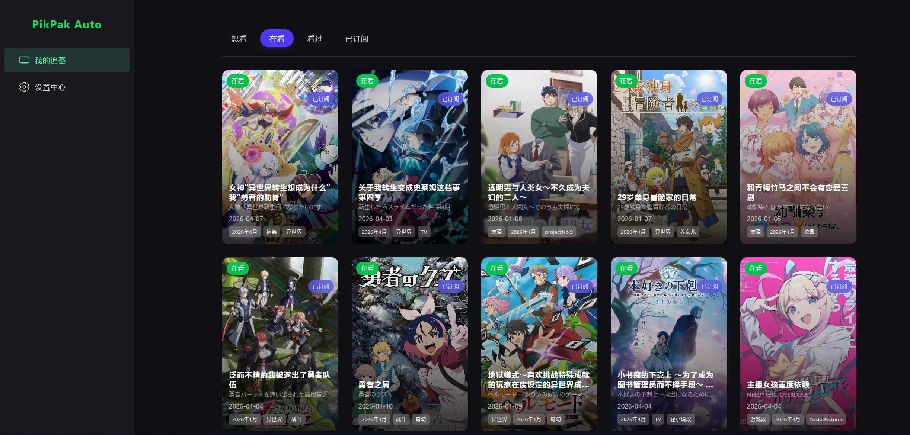
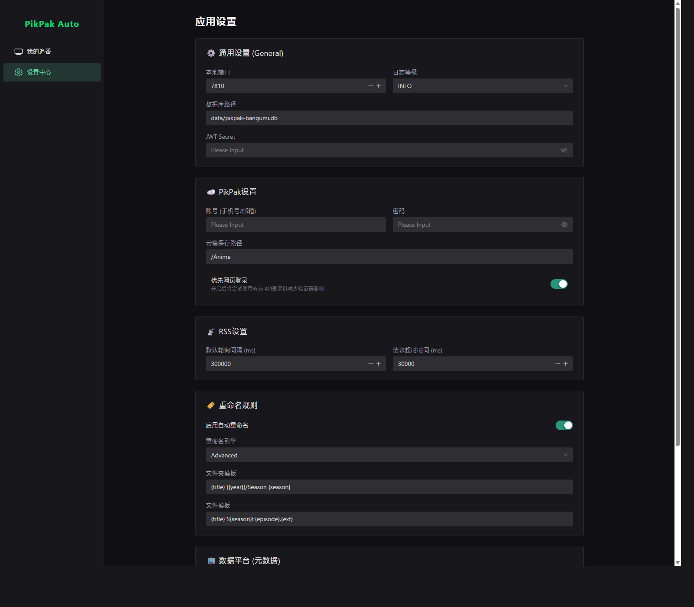
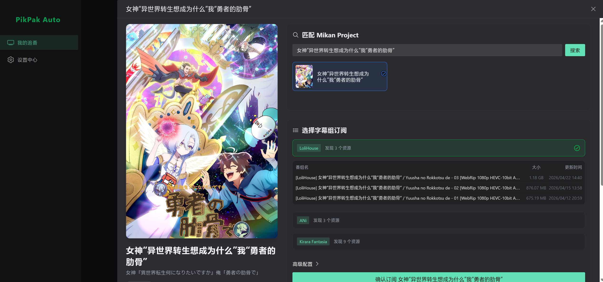
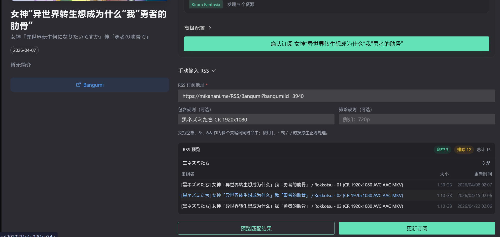

# PikPak Auto Bangumi

PikPak Auto Bangumi is an automated anime workflow that connects Bangumi collection tracking, RSS subscription management, PikPak offline delivery, cloud rename, danmaku refresh, and a Web UI into one Bun-based project.

PikPak Auto Bangumi 是一个面向追番场景的自动化系统，把 Bangumi 收藏同步、RSS 订阅、PikPak 离线下载、云端重命名、弹幕补传和网页管理界面整合到同一套运行链路中。

## Highlights

- Bangumi collection board with subscribed intersection view, detail drawer, and subject-bound subscription workflow
- Mikan-assisted subscription and manual RSS subscription under the same `bangumiSubjectId` model
- Replayable RSS pipeline with filtering, dedupe, PikPak delivery, rename, and danmaku upload
- Bun + Elysia + SQLite + Drizzle backend with Vue 3 + Vite + Naive UI frontend
- CLI mode and Web UI mode for both headless automation and local management

## Screenshots

Live board with real Bangumi subscriptions:



Settings center runtime state:



Detail drawer with Mikan subgroup subscription:



Detail drawer with manual RSS preview and rule editing:



## Core Features | 核心能力

| Feature | Description |
| --- | --- |
| Bangumi sync | Sync Bangumi collection states, paginate by status, and show subscribed intersection view |
| Subject-bound subscription model | Keep `bangumiSubjectId` and `mikanBangumiId` separate to avoid identity confusion |
| Mikan helper flow | Search Mikan subjects, inspect subgroup feeds, and subscribe from the detail drawer |
| Manual RSS flow | Bind a custom RSS feed to a Bangumi subject with include and exclude rules |
| Replay and dedupe | Replay filtered history after rule changes and avoid duplicate episode delivery |
| Cloud rename | Use Bangumi and TMDB context to normalize folder and file names after delivery |
| Danmaku refresh | Download DanDanPlay XML, refresh by expiration policy, and upload beside the video |
| Web UI + REST API | Serve the management UI and API from one backend runtime |

## Tech Stack

- Runtime: Bun
- Backend: Elysia, SQLite, Drizzle ORM, Zod
- Frontend: Vue 3, Vite, Pinia, Vue Router, Naive UI, Tailwind CSS
- Integrations: Bangumi, Mikan, PikPak, TMDB, DanDanPlay

## Quick Start | 快速开始

### 1. Install dependencies | 安装依赖

```bash
bun install
cd frontend && bun install && cd ..
```

### 2. Prepare config | 准备配置

Create `config.json` in the project root. The file is ignored by git and should hold your runtime credentials.

在项目根目录创建 `config.json`。该文件已被 git 忽略，用于保存运行时配置与私密凭证。

Minimal example:

```json
{
	"pikpak": {
		"username": "your@email.com",
		"password": "your-password",
		"cloudBasePath": "/Anime"
	},
	"bangumi": {
		"token": ""
	},
	"tmdb": {
		"apiKey": "",
		"language": "zh-CN"
	},
	"dandanplay": {
		"enabled": false,
		"appId": "",
		"appSecret": ""
	}
}
```

### 3. Run the project | 启动项目

Production-style local run:

```bash
bun run build:frontend
bun run start
```

Windows quick start:

```bat
start.bat
```

The batch launcher checks Bun, installs dependencies when needed, and starts the server for local use.

Windows 用户也可以直接运行 `start.bat`。该脚本会检查 Bun、在缺失依赖时自动安装，并启动本地服务。

Development mode:

```bash
# terminal 1
bun run dev

# terminal 2
cd frontend && bun run dev
```

CLI mode:

```bash
bun run start:cli
```

Default server endpoint: `http://localhost:7810`

## Typical Workflow | 典型使用流程

1. Configure PikPak, Bangumi, and optional TMDB or DanDanPlay credentials in the settings page
2. Open the collection board and select a Bangumi subject
3. Subscribe through either a Mikan subgroup feed or a manual RSS feed
4. Let the scheduler fetch RSS items, filter them, deliver matched files to PikPak, and apply rename or danmaku tasks

1. 在设置页填写 PikPak、Bangumi，以及可选的 TMDB、DanDanPlay 配置
2. 打开收藏看板，选择一部番剧
3. 通过 Mikan 字幕组订阅或手动 RSS 订阅完成绑定
4. 由调度器持续拉取 RSS、执行过滤、投递 PikPak，并完成重命名和弹幕处理

## Documentation | 文档索引

- [Wiki index](./docs/wiki/index.md)
- [Getting started](./docs/wiki/getting-started.md)
- [Web UI flow](./docs/wiki/web-ui.md)
- [Configuration](./docs/wiki/config.md)
- [Architecture](./docs/wiki/architecture.md)
- [Development docs](./docs/wiki/dev/index.md)

## Project References | 项目参考

This project stands on ideas, workflows, and integration experience from the following repositories and services:

- [EstrellaXD/Auto_Bangumi](https://github.com/EstrellaXD/Auto_Bangumi)
- [CuteLeaf/Firefly](https://github.com/CuteLeaf/Firefly)
- [Sonder9999/pikpak_calssify](https://github.com/Sonder9999/pikpak_calssify)
- [Quan666/PikPakAPI](https://github.com/Quan666/PikPakAPI)
- [Bangumi](https://bangumi.tv/)
- [Mikan Project](https://mikanani.me/)

## Notes

- `config.json`, database files, token caches, and runtime logs should never be committed
- If you import qBittorrent RSS rules, prefer validating against a copied database first
- The Web UI and backend share one subscription model, so changes in UI flows should stay aligned with API behavior
